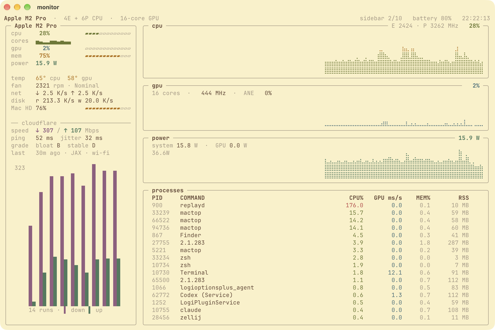
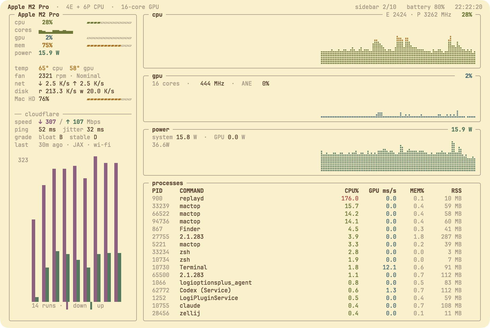
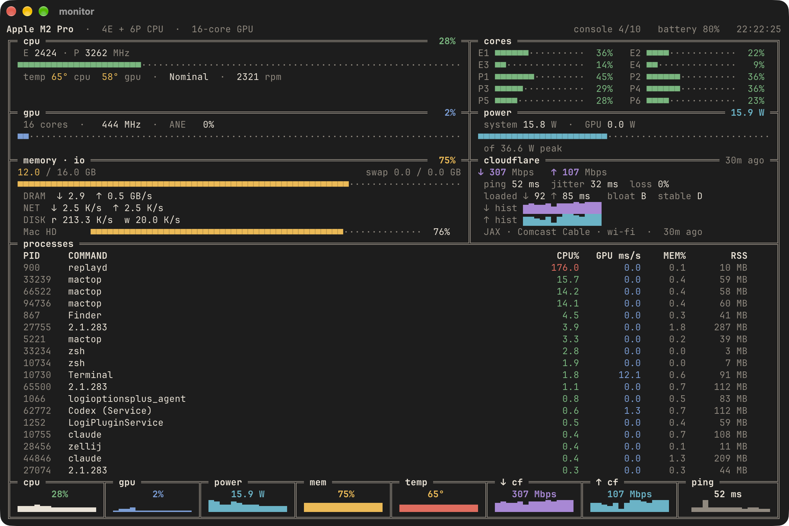
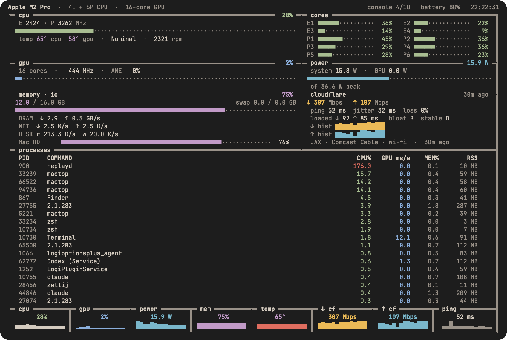
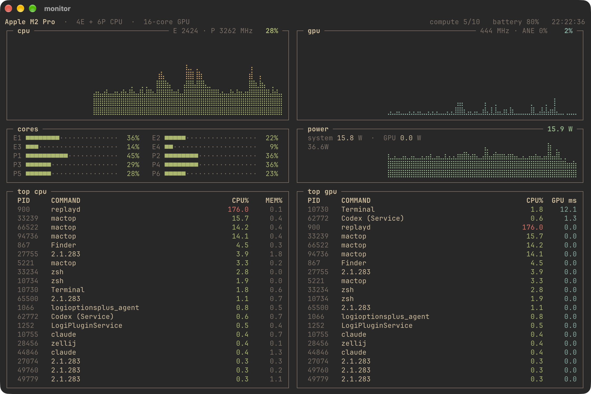
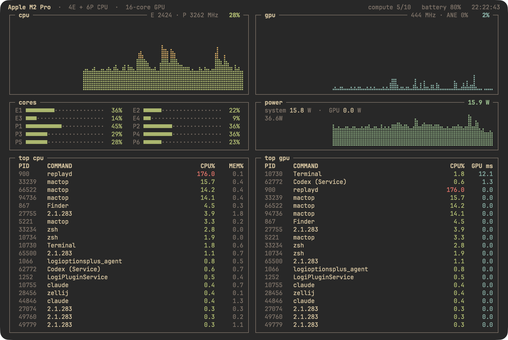

# tidemark

A terminal system monitor for Apple Silicon Macs: CPU, GPU, power, memory pressure, thermals,
network and your saved Cloudflare speed tests, with ten layouts on the `l` key. Written in Go
with [Bubble Tea](https://github.com/charmbracelet/bubbletea); data comes from
[mactop](https://github.com/metaspartan/mactop).

<table>
  <tr>
    <th></th>
    <th>Ghostty</th>
    <th>Alacritty</th>
  </tr>
  <tr>
    <th>light<br><sub>Gruvbox Material Light</sub><br><sub><code>sidebar</code></sub></th>
    <td></td>
    <td></td>
  </tr>
  <tr>
    <th>warm dark<br><sub>Earthsong-based</sub><br><sub><code>console</code></sub></th>
    <td></td>
    <td></td>
  </tr>
  <tr>
    <th>soft dark<br><sub>Gruvbox Material Dark</sub><br><sub><code>compute</code></sub></th>
    <td></td>
    <td></td>
  </tr>
</table>

<sub>Real 140×42 terminal windows running the recorded mactop sample from the tests. tidemark
only uses the terminal's 16 ANSI colours, so it takes on whatever theme you run.</sub>

## Install

Needs macOS on Apple Silicon and [mactop](https://github.com/metaspartan/mactop).

```sh
brew install mactop
curl -fsSL https://github.com/lukeemerson/tidemark/releases/latest/download/tidemark_darwin_arm64.tar.gz | tar -xz
mv tidemark_darwin_arm64/tidemark ~/.local/bin/    # or anywhere on your PATH
tidemark
```

Downloaded the release in a browser instead? macOS quarantines it; clear that once with
`xattr -d com.apple.quarantine ~/.local/bin/tidemark`.

**From source** (Go 1.27+):

```sh
git clone https://github.com/lukeemerson/tidemark && cd tidemark/2d/prod
go build -o ~/.local/bin/tidemark ./cmd/tidemark
```

`r` needs [cloudflare-speed-cli](https://github.com/kavehtehrani/cloudflare-speed-cli). Without it
the cloudflare panels still show any runs it saved earlier.

| key | does |
| --- | --- |
| `l` / `L` | next / previous layout (remembered in `~/.config/tidemark/config.json`) |
| `c` | switch palette: your terminal's 16 colours (default) or the built-in `tidemark` palette |
| `r` | run a Cloudflare speed test (~30 s) and reload the cloudflare panels |
| `space` | pause (the screen holds; samples keep arriving) / back to live |
| `[` `]` · `{` `}` | while paused: step one unit · jump 30 (a sample, or 10 s on the 24h span) |
| `z` | scrub span: the 400 samples in memory → the last hour on disk → the last 24 h (10 s buckets) |
| `m` | mark the moment on screen as B: graphs ghost it, values show their difference · `m` again clears |
| `o` | settings: layout, palette, interval and store, changed live and saved on close |
| `q` | quit |

`tidemark -i 500` samples every 500 ms for that run (default 1000, or what `o` saved). History is kept in
`~/Library/Application Support/tidemark/history` (the last hour of raw samples, and 24 h of 10 s
summaries, about 75 MB at most); `-nostore` turns that off for a run, and `o` for good. `tidemark -rec session.raw` also records
mactop's samples to a file; `tidemark -play session.raw` replays one at its recorded pace (scrub
it the same way; load and memory pressure aren't recorded, so they show `—`).

While something looks wrong, a line under the header says so, highest priority first:
`▲ throttling` (thermal state isn't Nominal), `▲ swapping` (swap up over 256 MB in 10 samples
under memory pressure) or `▲ runaway` (the top process above one full core for 10 samples). It
clears after 5 quiet samples, and each firing leaves a `▲` on the paused scrubber.

## Layouts

Each layout has its own frame style. Every one scales down: below its minimum size it hands
over to `tiles`, which fits down to 20×20, and the header says so (`sidebar → tiles`).

| # | layout | frame | for |
| --- | --- | --- | --- |
| 1 | `tiles` | heavy `┏━┓` | the overview: 8 summary tiles, graphs, processes and a side column |
| 2 | `sidebar` | rounded `╭─╮` | every number in one column, graphs over processes |
| 3 | `instrument` | double `╔═╦═╗` | one frame split by shared dividers; bars and numbers, full-width processes |
| 4 | `console` | double + tile band | instrument with the summary tiles closing the frame |
| 5 | `compute` | square `┌─┐` | CPU and GPU side by side, down to the top CPU and GPU processes |
| 6 | `memory` | dashed `┌╌┐` | usage, kernel pressure, swap and load; processes by memory |
| 7 | `io` | heavy dashed `┏╍┓` | network and disk throughput, the full speed-test history |
| 8 | `glance` | rules `── ──` | a small pane: one line per stat, sensors, top processes |
| 9 | `wall` | block `▛▀▜` | every history as a full-width graph, no tables |
| 10 | `thermal` | ascii `+-+` | power and heat: energy readout, CPU and GPU temperature graphs |

## Components

Everything is drawn from a few pieces in [`2d/prod/internal/ui/draw.go`](2d/prod/internal/ui/draw.go). These
examples are printed by that code from the test sample. Their design tokens and HTML previews
are in [`design-system/`](design-system/).

**Frames:** one `border` set per layout. Titles sit in the top edge and values in its right end.

```
┏━ heavy ━━━━━━┓ ╭─ rounded ────╮ ╔═ double ═════╗ ┌─ square ─────┐ ┌╌ dashed ╌╌╌╌╌┐
┃              ┃ │              │ ║              ║ │              │ ╎              ╎
┗━━━━━━━━━━━━━━┛ ╰──────────────╯ ╚══════════════╝ └──────────────┘ └╌╌╌╌╌╌╌╌╌╌╌╌╌╌┘

┏╍ heavy dash ╍┓ +- ascii ------+ ▛▀ block ▀▀▀▀▀▀▜ ── rules ───────
╏              ╏ |              | ▌              ▐
┗╍╍╍╍╍╍╍╍╍╍╍╍╍╍┛ +--------------+ ▙▄▄▄▄▄▄▄▄▄▄▄▄▄▄▟
```

**Tile:** a value and its sparkline.

```
┏━ cpu ━━━━━━━┓ ┏━ gpu ━━━━━━━┓ ┏━ power ━━━━━┓ ┏━ mem ━━━━━━━━┓
┃     28%     ┃ ┃      2%     ┃ ┃   15.9 W    ┃ ┃      75%     ┃
┃ ▅▄▄▃▃▃▃▃▃▃▃ ┃ ┃ ▃▁▁▁▁▁▁▁▁▁▁ ┃ ┃ ▅▇▆▅▅▅▄▄▄▄▄ ┃ ┃ ▆▆▆▆▆▆▆▆▆▆▆▆ ┃
┗━━━━━━━━━━━━━┛ ┗━━━━━━━━━━━━━┛ ┗━━━━━━━━━━━━━┛ ┗━━━━━━━━━━━━━━┛
```

**Braille graph:** two samples per cell, four dots high, in the series colour.

**Colour roles:** each series keeps one ANSI slot everywhere it appears (cpu cyan, gpu blue,
power magenta, memory bright cyan, temperature bright magenta, in/download bright blue,
out/upload slot 7, or slot 0 on light backgrounds). Green, amber and red only mean state: meters, memory pressure,
errors. Numbers stay in the text colour.

**Built-in palette** (`c`): a fixed truecolor set with separate steps for dark and light
backgrounds (tidemark asks the terminal which it has). It was checked with a colour validator for
lightness, chroma, colour-blind separation and contrast against dark and light terminal backgrounds;
the remaining edge cases (dark ↓/↑ for red-weak vision, three light-mode hues under 3:1 contrast)
all carry visible labels.

```
┏━ cpu ━━━━━━━━━━━━━━━━━━━━━━━━━━━━━  28% ━┓
┃  E 2424 · P 3262 MHz                     ┃
┃ ⠀⠀⠀⠀⠀⠀⠀⠀⠀⠀⢀⡀⠀⠀⠀⠀⠀⣄⣄⢀⡀⠀⠀⠀⠀⠀⠀⠀⠀⠀⠀⠀⢠⠀⠀⠀⠀⠀⠀⠀ ┃
┃ ⣀⣀⣀⢀⣄⢀⣠⢠⣀⣀⣾⣿⣶⣄⣀⣀⢠⣿⣿⣼⣿⣦⣤⣀⣀⢀⡀⢀⣀⣄⡀⣀⣿⣶⣼⣦⣀⣠⣀⠀ ┃
┃ ⣿⣿⣿⣿⣿⣿⣿⣿⣿⣿⣿⣿⣿⣿⣿⣿⣿⣿⣿⣿⣿⣿⣿⣿⣿⣿⣿⣿⣿⣿⣿⣿⣿⣿⣿⣿⣿⣿⣿⣿ ┃
┗━━━━━━━━━━━━━━━━━━━━━━━━━━━━━━━━━━━━━━━━━━┛
```

**Bars:** `■·` in most layouts and `▰▱` in the sidebar. Cores get a bar each.

```
■■■■■■■■■■■■■■■·········
▰▰▰▰▰▰▰▰▰▰▰▰▰▰▰▱▱▱▱▱▱▱▱▱

E1 ■■■■■■············  36%   E2 ■■■■··············  22%
E3 ■■■···············  14%   E4 ■■················   9%
```

**Stat lines:** the tile row folded to one line each for narrow terminals.

```
cpu    28%      ▃▃▃▃▃▃▃▃▅▅▄▄▄▅▄▄▃▃▃▃▃▃▃▃
gpu     2%      ▁▁▂▂▁▁▁▂▁▂▁▂▂▃▁▁▁▁▁▁▁▁▁▁
power 15.9 W    ▅▅▅▅▆▅▅▅▆▅█▇▅▅▇▆▅▅▅▄▄▄▄▄
```

**Run bars:** download and upload for each saved speed test, oldest on the left.

```
   ▅  ▄  ▅  ▂  █  ▆  ▆
█  █  █  █  █  █  █  █
█▁ █▆ █▅ █▃ █▁ █▅ █▆ █▅
██ ██ ██ ██ ██ ██ ██ ██
```

**Bands:** sections sharing one frame's dividers (`instrument`, `console`).

```
╔═ gpu ═════════════════════   2% ═╦═ power ═════════ 15.9 W ═╗
║  16 cores  ·   444 MHz  ·  ANE … ║ system 15.8 W            ║
║ ■······························· ║ ■■■■■■■■■■·············· ║
╚══════════════════════════════════╩══════════════════════════╝
```

## Where the numbers come from

- **mactop** (`--headless`, streamed): CPU, GPU, ANE, per-core use, frequencies, power,
  temperatures, fans, memory, DRAM bandwidth, network and disk rates, battery and the top 20
  processes. `tidemark` draws its frames before the first sample, then fills them in.
- **sysctl:** load averages (`vm.loadavg`), kernel memory pressure and the available %
  (`kern.memorystatus_*`), and the names of processes that mactop reports only as a version number.
- **cloudflare-speed-cli:** the saved runs in `~/Library/Application Support/cloudflare-speed-cli/runs`.
  They're read from disk; a test only runs when you press `r`.

If mactop exits or sends something unreadable, `tidemark` quits with the reason and exit status 1.

## Development

```sh
cd 2d/prod && go test ./...
```

- **Decoding:** a 90-second mactop recording (`2d/prod/internal/source/testdata`) drives the tests.
- **Sweep:** every layout is drawn at sizes from 1×1 to 200×80, before and after data. The test
  fails if a line overflows, the frame doesn't fit, a box is left open at the bottom, or a box
  interior stays blank for 4+ rows.

`scripts/release.sh v0.1.0` runs the tests, builds `tidemark_darwin_arm64.tar.gz` (plus its
sha256) and attaches both to a draft GitHub release, ready to publish.

[`2d/dev/PLAN.md`](2d/dev/PLAN.md) has the build notes and what comes next: an on-demand settings menu, then
rewind, a "what changed?" feed, and processes grouped by project.

## License

[MIT](LICENSE)
